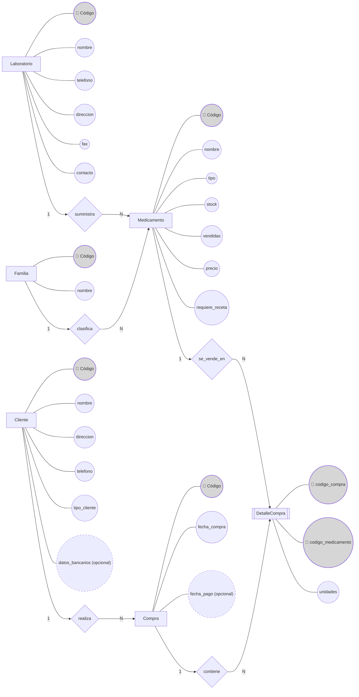

# P2 - Modelo entidad-relación Farmacia
**Fecha:** 24 de septiembre del 2025  
**Autor:** [alu0101474311@ull.edu.es](mailto:alu0101474311@ull.edu.es) (Tomás Pino Pérez)

---

# 1. Diagrama Entidad/Relación Farmacia

# 2. Descripción del modelo

## 2.1. Entidades

| Entidad                 |                 Atributos clave                  | Descripción                                                                                                                                               |
| ----------------------- |:------------------------------------------------:| --------------------------------------------------------------------------------------------------------------------------------------------------------- |
| **Medicamento (MED)**   |                   Código (PK)                    | Identificador único. Otros: nombre, tipo, stock $\ge0$, vendidas $\ge0$, precio $\gt0$, requiere_receta (boolean). FK: codigo_laboratorio, codigo_familia |
| **Laboratorio (LAB)**   |                   Código (PK)                    | Nombre, teléfono, dirección, fax, contacto. Suministra $1:N$ medicamentos                                                                                 |
| **Familia (FAM)**       |                   Código (PK)                    | Nombre. Clasifica $1:N$ medicamentos                                                                                                                      |
| **Cliente (CLI)**       |                   Código (PK)                    | Nombre, dirección, teléfono, tipo_cliente $\in$ {contado, crédito}, datos_bancarios (opcional, solo crédito)                                              |
| **Compra (CMP)**        |                   Código (PK)                    | Fecha_compra $\le$ hoy, fecha_pago (opcional, solo crédito $\ge$ fecha_compra). FK: codigo_cliente                                                        |
| **DetalleCompra (DET)** | PK compuesta: codigo_compra + codigo_medicamento | Unidades $\gt0$. FK: codigo_compra → CMP, codigo_medicamento → MED                                                                                        |

## 2.2. Relaciones

| Relación                    | Cardinalidad | Semántica                                                                                         |
| --------------------------- |:------------:| ------------------------------------------------------------------------------------------------- |
| Laboratorio – Medicamento   |    $1:N$     | Un laboratorio suministra varios medicamentos; cada medicamento tiene un único laboratorio        |
| Familia – Medicamento       |    $1:N$     | Una familia clasifica varios medicamentos; cada medicamento pertenece a una familia               |
| Cliente – Compra            |    $1:N$     | Un cliente puede realizar varias compras; cada compra pertenece a un cliente                      |
| Compra – DetalleCompra      |    $1:N$     | Una compra contiene varios detalles (medicamentos distintos); cada detalle pertenece a una compra |
| Medicamento – DetalleCompra |    $1:N$     | Un medicamento puede aparecer en muchos detalles; cada detalle corresponde a un único medicamento |

## 2.3. Restricciones semánticas

- **Medicamento:**
    - stock, vendidas $\ge0$
    - precio $\gt0$
    - requiere receta: TRUE/FALSE
    - debe tener un laboratorio y una familia asociados
- **Cliente:**
    - tipo_cliente $\in$ {contado, crédito}
    - contado → datos_bancarios = NULL
    - crédito → datos_bancarios obligatorio
- **Compra:**
    - fecha_compra $\le$ hoy
    - fecha_pago nulo si contado
    - fecha_pago $\ge$ fecha_compra si crédito
- **DetalleCompra:**
    - unidades $\gt0$
    - clave compuesta (codigo_compra + codigo_medicamento) → evita repetición del mismo medicamento en la misma compra
    - unidades $\le$ stock disponible del medicamento
- **General:**
    - Una compra debe tener al menos un detalle
    - Cada medicamento en un detalle debe existir en el inventario
