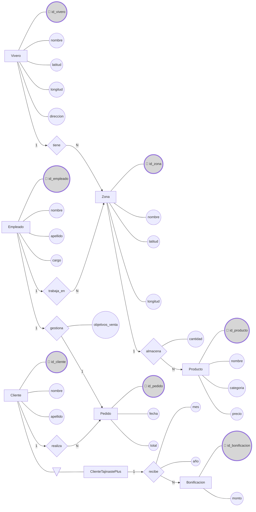

**Fecha:** 1 de octubre del 2025

**Autor:** alu0101474311@ull.edu.es (Tomás Pino Pérez)

---

## 1. Diagrama Entidad/Relación

## 2. Descripción del modelo

### 2.1. Entidades

| Entidad                  | Atributos clave / PK               | Otros atributos relevantes           |
| ------------------------ | ---------------------------------- | ------------------------------------ |
| **Vivero**               | id_vivero                          | nombre, latitud, longitud, direccion |
| **Zona**                 | id_zona                            | nombre, latitud, longitud            |
| **Producto**             | id_producto                        | nombre, categoria, precio            |
| **Empleado**             | id_empleado                        | nombre, apellido, cargo              |
| **Cliente**              | id_cliente                         | nombre, apellido                     |
| **ClienteTajinastePlus** | id_cliente (hereda de **Cliente**) |                                      |
| **Pedido**               | id_pedido                          | fecha, total                         |
| **Bonificacion**         | id_bonificacion                    | id_cliente (FK), mes, anio, monto    |

### 2.2. Relaciones

| Relación       | Entidades involucradas                          | Cardinalidad / descripción                                                   | Atributos       |
| -------------- | ----------------------------------------------- | ---------------------------------------------------------------------------- | --------------- |
| **tiene**      | Vivero $\rightarrow$ Zona                       | $1:N\rightarrow$ un vivero tiene varias zonas                                |                 |
| **almacena**   | Zona $\rightarrow$ Producto                     | $1:N\rightarrow$ una zona puede almacenar varios productos                   | cantidad        |
| **trabaja_en** | Empleado $\rightarrow$ Zona                     | $1:N\rightarrow$ un empleado puede trabajar en varias zonas                  |                 |
| **gestiona**   | Empleado $\rightarrow$ Pedido                   | $1:1\rightarrow$ un empleado gestiona un pedidos                             | objetivos_venta |
| **realiza**    | Cliente $\rightarrow$ Pedido                    | $1:N\rightarrow$ un cliente puede realizar varios pedidos                    |                 |
| **herencia**   | Cliente $\rightarrow$ ClienteTajinastePlus      | Cliente es padre de ClienteTajinastePlus                                     |                 |
| **recibe**     | ClienteTajinastePlus $\rightarrow$ Bonificacion | $1:N\rightarrow$ un clienteTajinastePlus puede recibir varias bonificaciones | mes, año        |

### 2.3. Restricciones semánticas

- **Empleado**
    - Nunca puede estar asignado a dos zonas simultáneamente.
    - Debe existir un registro histórico por cada asignación temporal (fecha_inicio, fecha_fin).
- **Pedido**
    - Cada pedido tiene **un único responsable** (empleado).
    - Cada pedido pertenece a **un solo cliente**, especialmente si es Tajinaste Plus.
- **Bonificación**
    - Solo aplica a clientes que sean parte del programa **Tajinaste Plus**.
    - La bonificación se calcula por **mes y año**, no puede haber duplicados para el mismo cliente en el mismo período.
- **Georreferenciación**
    - Latitud y longitud de viveros y zonas deben ser válidas según coordenadas geográficas.