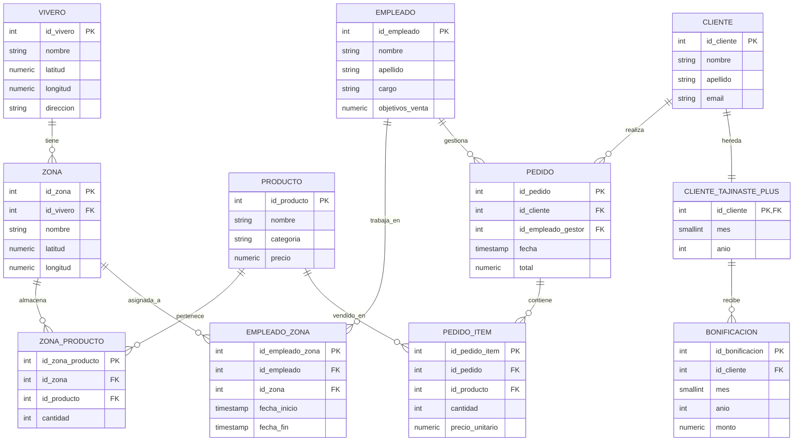

**Fecha:** 11 de octubre del 2025

**Autor:** alu0101474311@ull.edu.es (Tomás Pino Pérez)

---

## 1. Diagrama Relacional

## 2. Script

- **Start-Script:** [run_viveros.sh](./run_viveros.sh)
- **Script:** [p04-modelo-viveros.sql](./p04-modelo-viveros.sql)
- **Salida:** [output](./output.txt)